## Цель работы

1. Изучить возможности технологии Yandex DataLens для визуального анализа
структурированных наборов данных.
2. Получить навыки визуализации данных для последующего анализа с помощью
сервисов Yandex Cloud.
3. Получить навыки создания решений мониторинга/SIEM на базе облачных
продуктов и открытых программных решений.
4. Закрепить практические навыки использования SQL для анализа данных сетевой
активности в сегментированной корпоративной сети.

## Исходные данные

1.  Программное обеспечение ОС Windows 11
2.  VS Code
3.  Интерпретатор языка R 4.5.1

## План

1. Настроить подключение к Yandex Query из DataLens.
2. Создать из запроса YandexQuery датасет DataLens.
3. Делаем нужные графики и диаграммы.
4. Составляем дашборд.

## Шаги:

## Настроить подключение к Yandex Query из DataLens.

# Перейти в соответствующий сервис – https://datalens.yandex.ru/

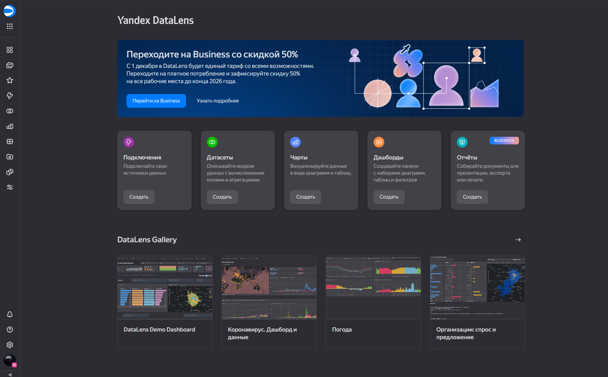

# Выбрать “Подключения” – “Создать новое подключение".

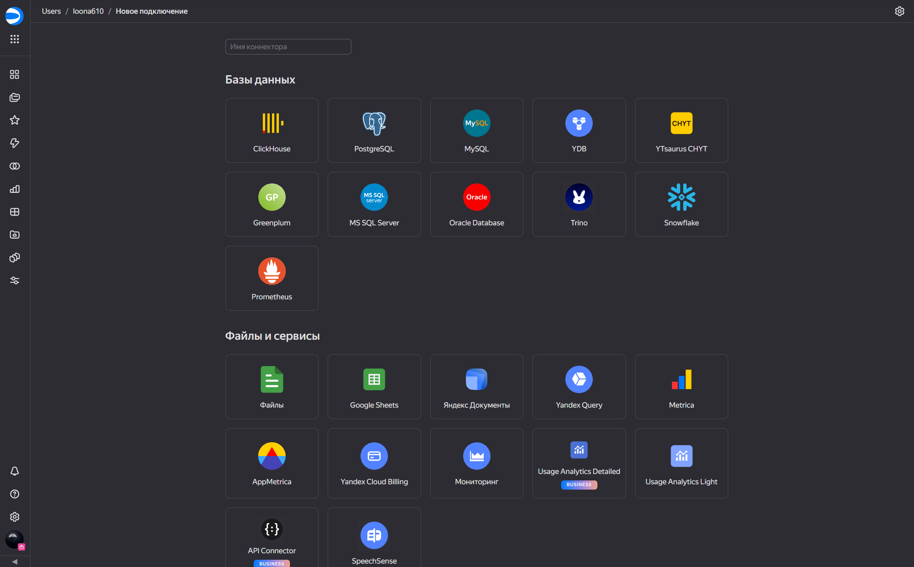

# Выбрать в разделе “Файлы и сервисы” Yandex Query.
# Настроить и проверить подключение.

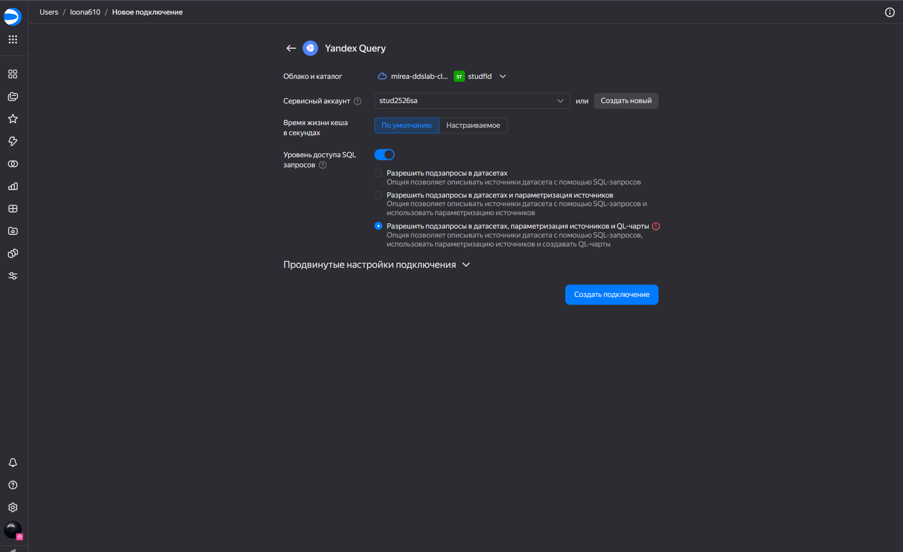

## Создать из запроса YandexQuery датасет DataLens.

# Создать из запроса YandexQuery датасет DataLens.

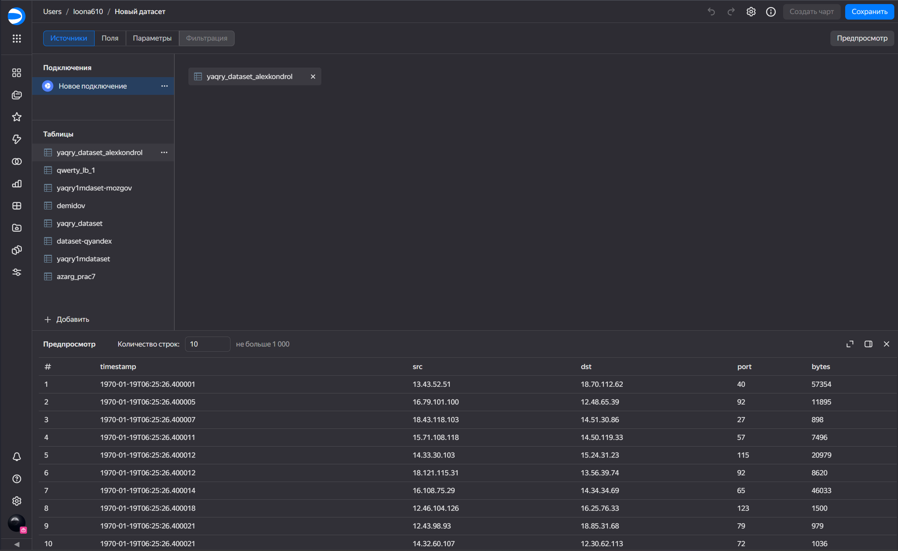

## Делаем нужные графики и диаграммы.

# Чарт с выбранным датасетом.

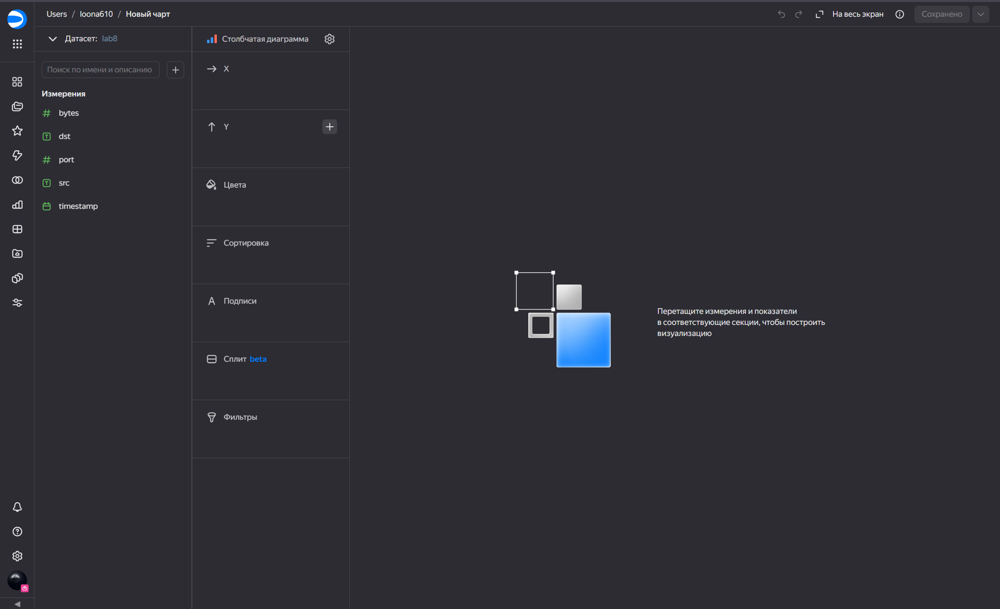

# Круговая диаграмма

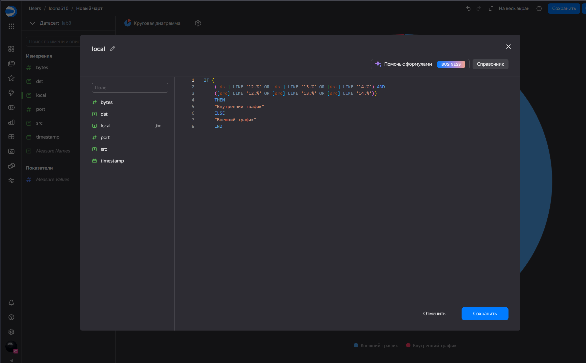

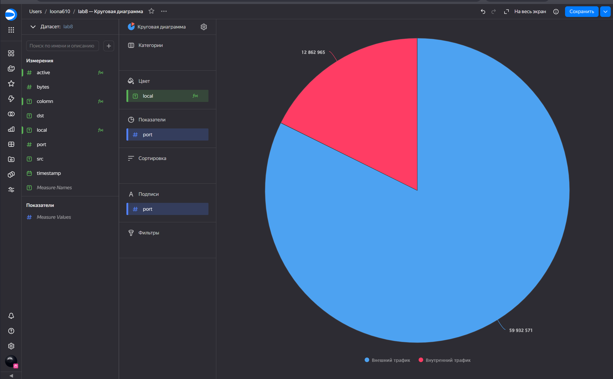

# Линейная диаграмма

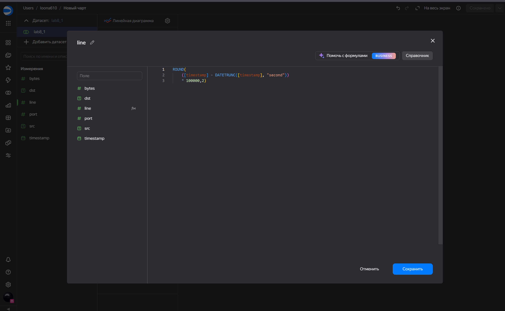

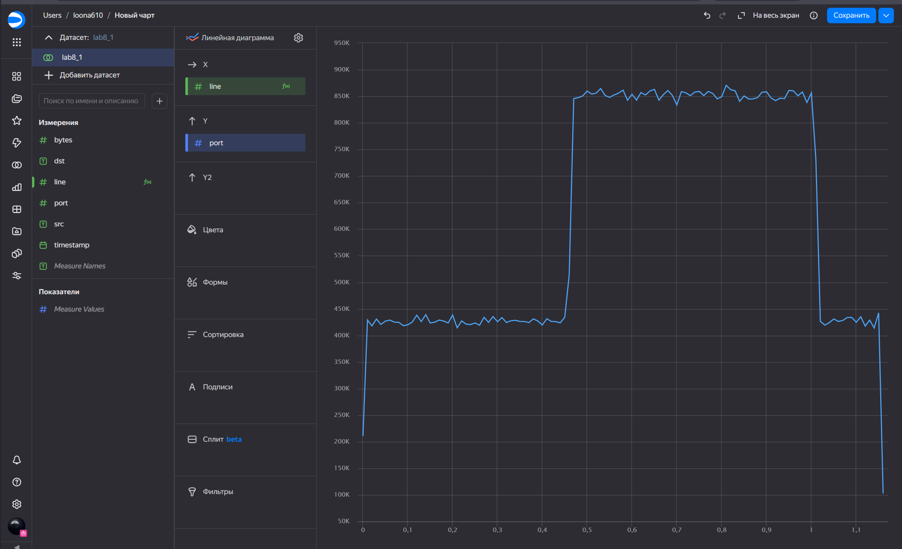

# Столбчатая диаграмма

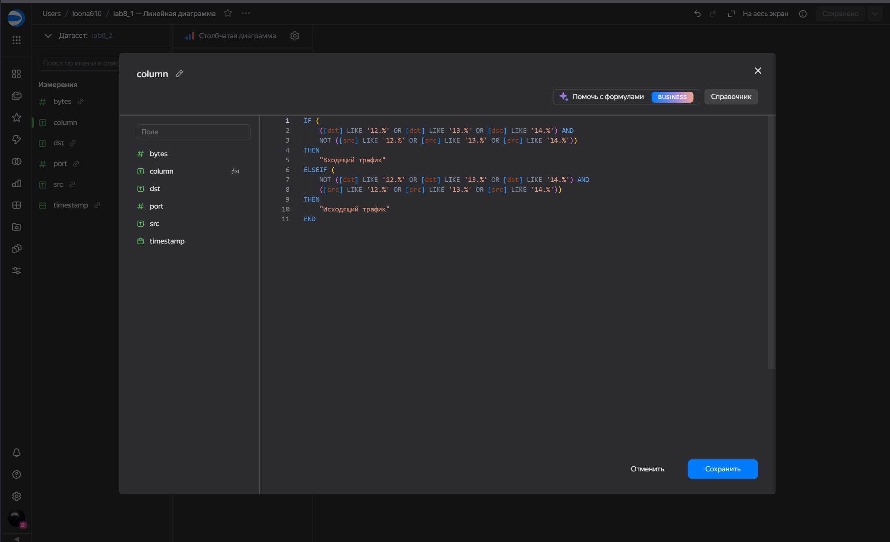

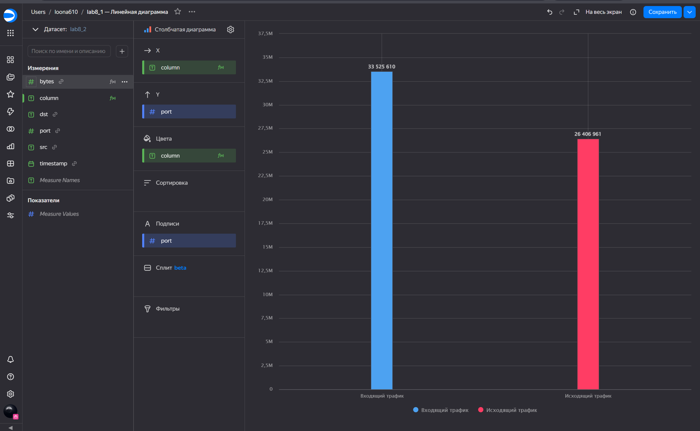

## Составляем дашборд.

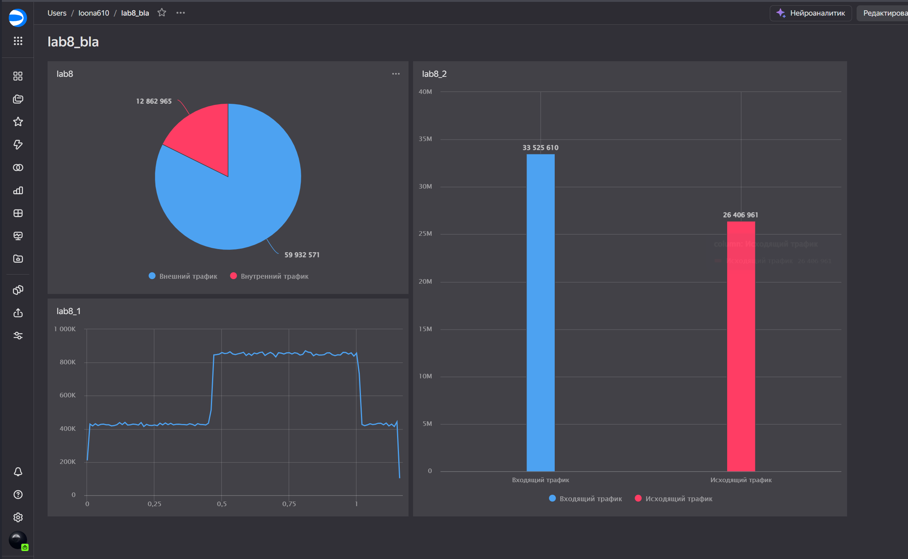

[Ссылка на дашборд](https://datalens.ru/sblmnpthhm42d-lab8-bla)

